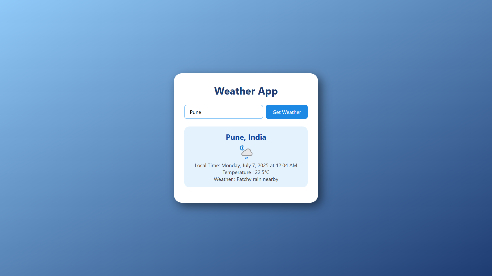

# 🌤️ Weather App

A simple, responsive Weather App that fetches and displays real-time weather information using the [OpenWeather API](https://openweathermap.org/api). Just enter the name of a city and get the current temperature, weather condition, icon, and local time!

---

## 🔗 Live Demo

👉 [Check it out here](https://weather-app-self-one-98.vercel.app/)

---

## 📸 Preview

---

## 🚀 Features

- 🌍 Real-time weather info for any city
- 🌡️ Displays temperature in Celsius
- 🌤️ Shows weather condition and a custom weather icon
- 🕒 Local time of the selected city (converted using timezone offset)
- ⚠️ Error message if city is not found
- 📱 Fully responsive design

---

## 🛠️ Technologies Used

- HTML5
- CSS3
- JavaScript (Vanilla)
- [OpenWeatherMap API](https://openweathermap.org/api)

---

## 📌 Future Improvements

- Add loading spinner
- Include 3-day forecast
- Support for dark/light theme toggle
- Graceful handling of API rate limit errors

---

## 👨‍💻 Author

Made by **[Swaraj Unde]**

---

## 📄 License

This project is open-source and free to use.
